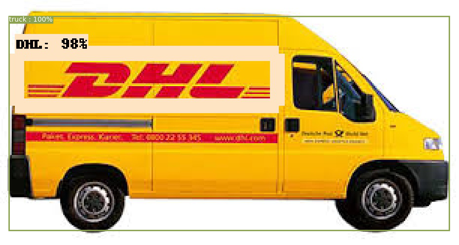
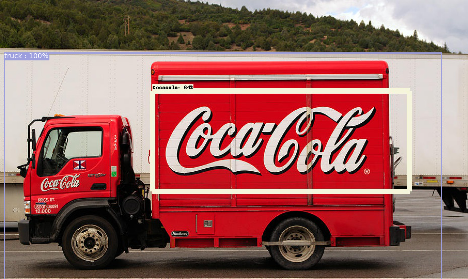

# Object-and-its-Logo-detection-from-an-image
## Demo images
<table>
  <tr>
    <td align="center">output image1 </td>
     <td align="center">output image2</td>
  </tr>
  <tr>
    <td valign="top"></td>
    <td valign="top"></td>
  </tr>
 </table>

Will be available soon

Credit: Some of code snippets have been taken from [repo](https://github.com/cfotache/pytorch_objectdetecttrack?fbclid=IwAR0Ih6PoswYW_JptXRWMJ6LX2hcKr82ROvOlYwPLE04RjreyCXsxVyv2XQk) and [repo](https://github.com/satojkovic/DeepLogo?fbclid=IwAR2bcJCeBxWqIBk33hr68nZoYdShDHiEmOiKnehcns3yR8FPXpND7jdGyVE)
